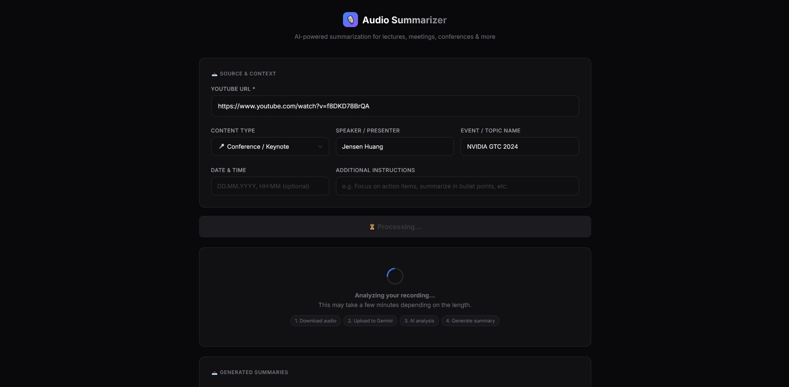
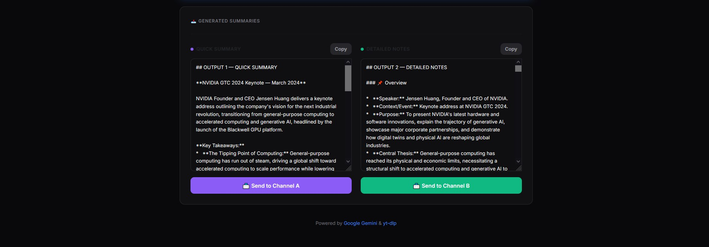

# 🎙️ Audio Summarizer — AI-Powered Audio Summarizer

> Transform any YouTube video into structured, actionable summaries using Google Gemini AI.  
> Works with lectures, business meetings, conferences, podcasts, webinars, and more.

[](https://python.org)
[](https://flask.palletsprojects.com)
[](https://ai.google.dev)
[](LICENSE)

---

## ✨ Features

- **Universal** — Works with any YouTube content: lectures, meetings, podcasts, live streams
- **Dual output** — Generates a _Quick Summary_ (shareable) and _Detailed Notes_ (documentation)
- **Content-type aware** — Selecting a type (Lecture, Meeting, Conference…) changes the AI's focus and output structure. Meetings get action item checklists; lectures get a glossary; conferences get an announcements section, etc.
- **Discord integration** — Send summaries directly to Discord channels via webhooks
- **Customizable prompts** — Edit `prompt.txt` to tailor the AI's output format to your workflow
- **Clean web UI** — Modern dark-themed interface, no frontend framework required

## 🖥️ Screenshot

##### INPUT



##### OUTPUT



## 🛠️ Tech Stack

| Layer          | Technology               |
| -------------- | ------------------------ |
| Backend        | Python 3, Flask          |
| AI / NLP       | Google Gemini 3.5 Flash  |
| Audio Download | yt-dlp + FFmpeg          |
| Frontend       | HTML5, CSS3, Bootstrap 5 |
| Notifications  | Discord Webhooks         |

---

## 🚀 Quick Start

### Prerequisites

- Python 3.10+
- [FFmpeg](https://ffmpeg.org/download.html) installed and available in PATH
- A [Google Gemini API key](https://aistudio.google.com/app/apikey) (free tier available)

### 1. Clone the repository

```bash
git clone https://github.com/YOUR_USERNAME/gemini-audio-summarizer.git
cd gemini-audio-summarizer
```

### 2. Install Python dependencies

```bash
pip install -r requirements.txt
```

### 3. Configure your credentials

```bash
cp secrets_example.py secrets.py
```

Open `secrets.py` and fill in your values:

```python
GEMINI_API_KEY    = "your-gemini-api-key"
WEBHOOK_CHANNEL_A = "https://discord.com/api/webhooks/..."   # optional
WEBHOOK_CHANNEL_B = "https://discord.com/api/webhooks/..."   # optional
```

### 4. Run the server

```bash
python app.py
```

Open your browser at **http://localhost:5000**

---

## 📋 Usage

1. Paste a YouTube URL into the input field
2. Select the content type (lecture, meeting, conference…)
3. Optionally add speaker name, event title, and extra instructions
4. Click **Analyze Recording** — the AI will download and process the audio
5. Review the **Quick Summary** and **Detailed Notes**
6. Copy or send directly to your Discord channels

---

## ⚙️ Customization

**Base prompt** — controlled by `prompt.txt`. Edit this to change the output structure, add sections, enforce a language, or adjust detail level. Reloaded on every request — no restart needed.

**Content-type instructions** — defined in the `CONTENT_TYPE_INSTRUCTIONS` dictionary at the top of `app.py`. Each type has its own focus areas and extra sections. Add new types or edit existing ones there.

---

## 📁 Project Structure

```
gemini-audio-summarizer/
├── app.py                  # Flask server & Gemini integration
├── prompt.txt              # AI prompt — customize to your needs
├── requirements.txt        # Python dependencies
├── secrets_example.py      # Configuration template
├── .gitignore
├── README.md
├── assets
└── templates/
    └── index.html          # Web UI
```

---

## 🤝 Contributing

Pull requests are welcome. For major changes, please open an issue first to discuss what you'd like to change.

---

## 📄 License

[MIT](LICENSE) — free to use, modify, and distribute.

---

_Built with [Google Gemini](https://ai.google.dev) and [yt-dlp](https://github.com/yt-dlp/yt-dlp)_
#
